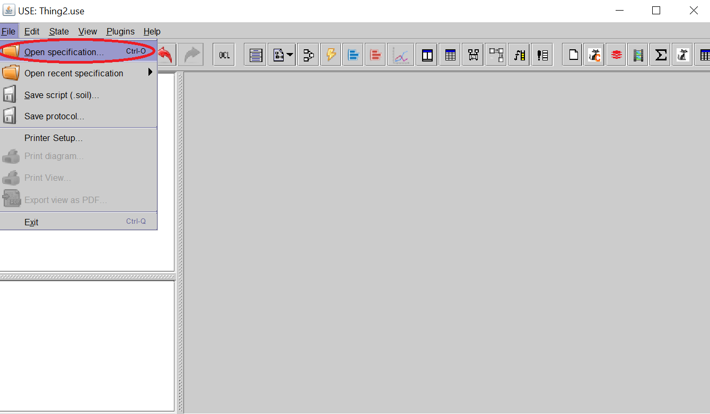
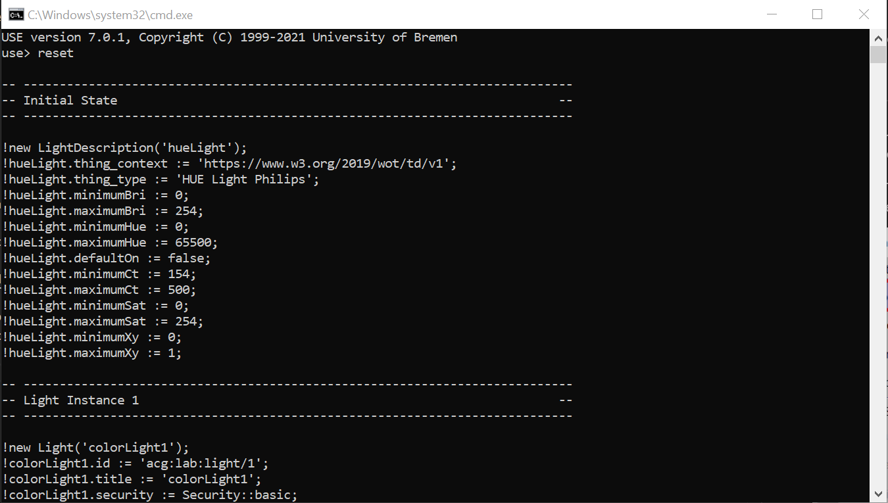
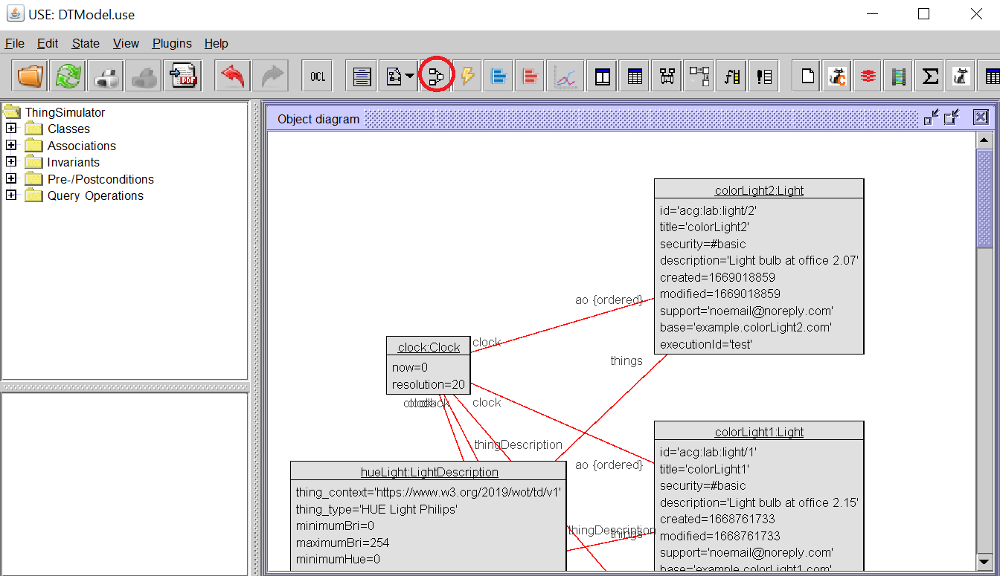
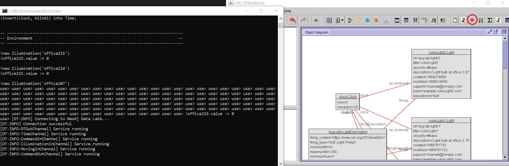

# MODELING AND SYNCHRONIZING DIGITAL TWIN ENVIRONMENTS (ANNSIM23)

# Overview
This is the repository used for the evaluation section of the paper MODELING AND SYNCHRONIZING DIGITAL TWIN ENVIRONMENTS for ANNSIM 2023. The example is prepared to be executed without having Physical Twins (PTs) deployed. For the execution of the example without the PTs, the environment is directly introduced into the DL by using commands.

# Requirements
To execute the evaluation scenario is required to have installed USE and Docker.

* USE can be downloaded from the [USE GitHub repository](https://github.com/useocl/use).
* Docker can be installed using the following guide on [Ubuntu](https://docs.docker.com/engine/install/ubuntu/) and on [Windows](https://docs.docker.com/desktop/install/windows-install/).

# Installation

The [installation](installation) folder contains the files that have to be copied inside the USE program to be able to replica the evaluation scenario. The content inside [oclextension](installation\oclextension) has to be copied inside the folder **oclextensions** from the USE program. In addition, the content inside [plugin](installation\plugin) has to be copied inside the folder **lib\plugins** from the USE program. 

The content of the oclextension folder is used to add new functions to USE for the execution of the DTS. For instance, a function for transforming angles into radians.

The content of the plugin folder is the driver created to communicate the Digital Twins (DTs) with the DL.

Finally, the scripts inside the [shell](installation\shell) folder allows the deployment (deployNeo4j) and stop (stopNeo4j) of a docker container for the DL using Neo4J.

# Getting started

Before executing the scenario, USE has to be initialized with the model and classes of the scenario. In addition, it has to be linked with the DL using the driver installed in the previous section.

All the files required to initialize the scenario are located in the [getting-started](getting-started) folder. The file [DTModel](getting-started/DTModel.use) is the main file of USE, it defines the model and the behavior of each DT. The first step for initializing the scenario is to open the DTModel in USE.

After the model is loaded, the scenario has to be initialized by executing the content of the [SOIL file](getting-started/DTModelInit.soil) in the command prompt of the USE program.

The button *Create object diagram view* shows the loaded scenario in the graphical user interface of USE.

Finally, the button *Start connection with the Digital Twin* executes the driver copied inside the plugin folder, creating the connection between the DTs and the DL. However, the DL has to be created before executing the driver by using the script described in the previous section.

# Replicating the evaluation scenario

The SOIL file located in the folder [replicating-scenario](replicating-scenario/Scenario.soil) replicates the evaluation scenario of the paper. The recommendation is to execute step by step copying the code inside each step in the command prompt of the USE program. In steps where multiple ticks from the clock have to be executed, for example in step 1, the recommendation is to execute the ticks in batches of 15-30 elements to avoid errors in the USE program.

Finally, for researchers that don't have PTs deployed, some steps includes commands for the DL to simulate the functionality of the driver that connects the PTs and the DL. For instance, step 2 has commands to simulate the presence of *worker1* and to simulate the interaction of *worker1* with the light bulbs of the office 2.15.